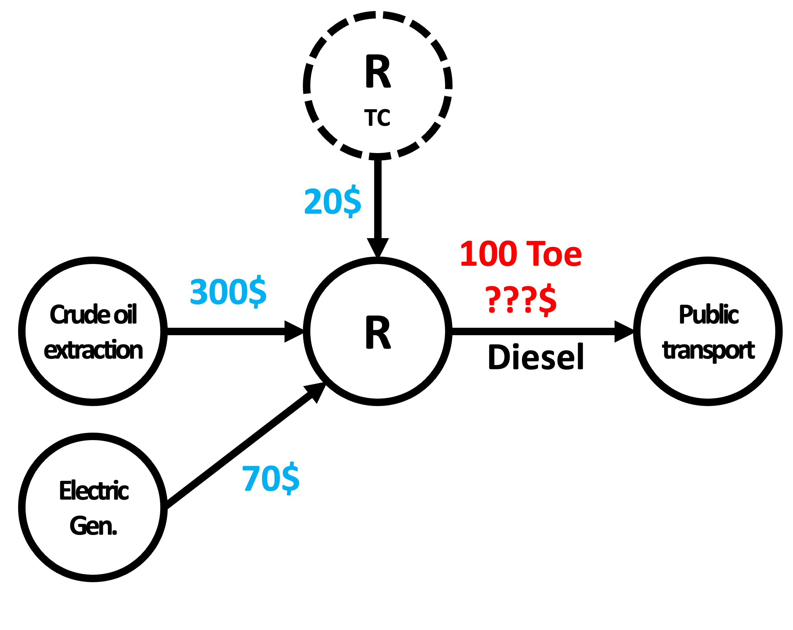
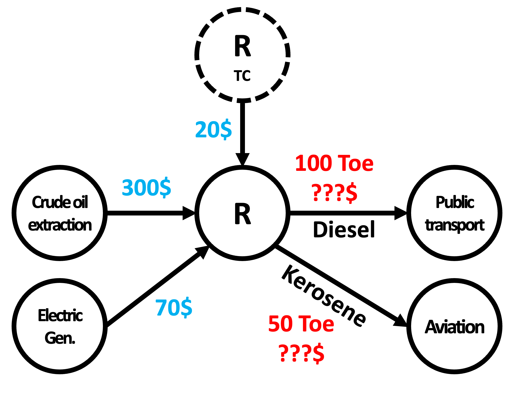
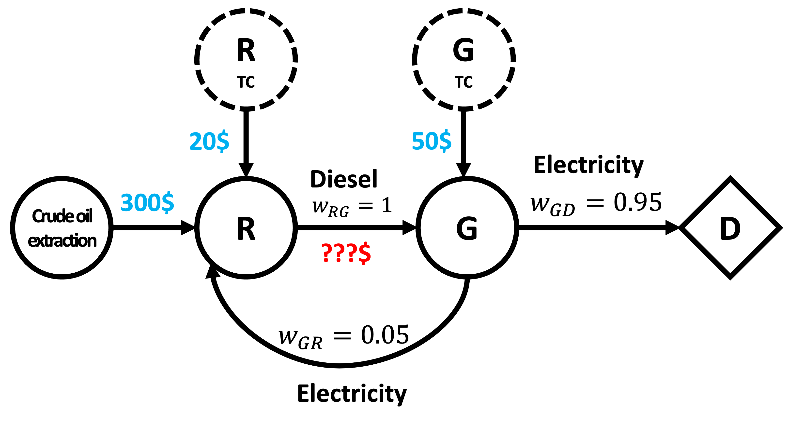
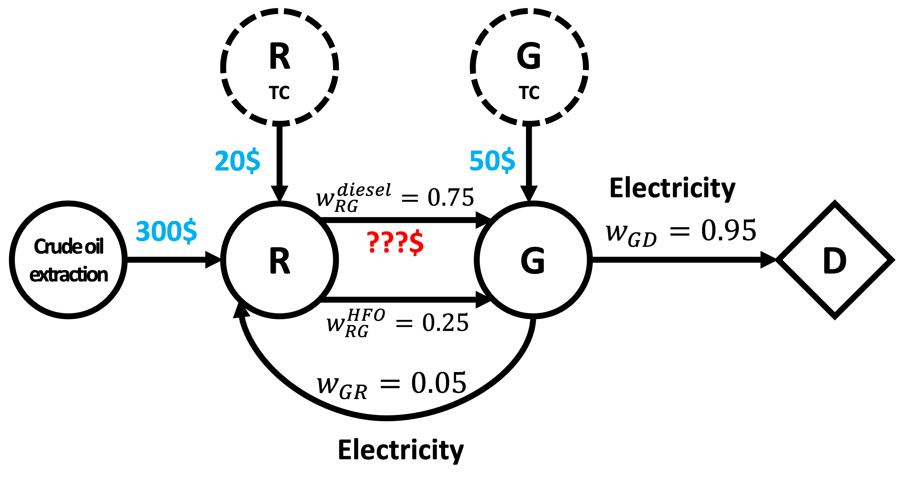
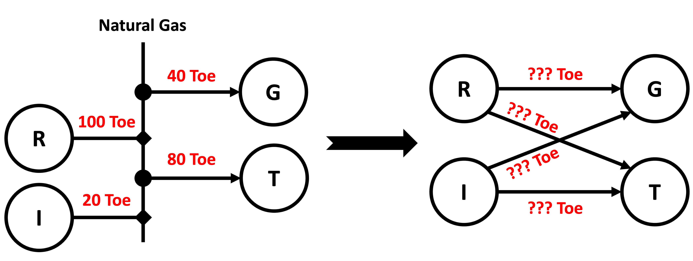
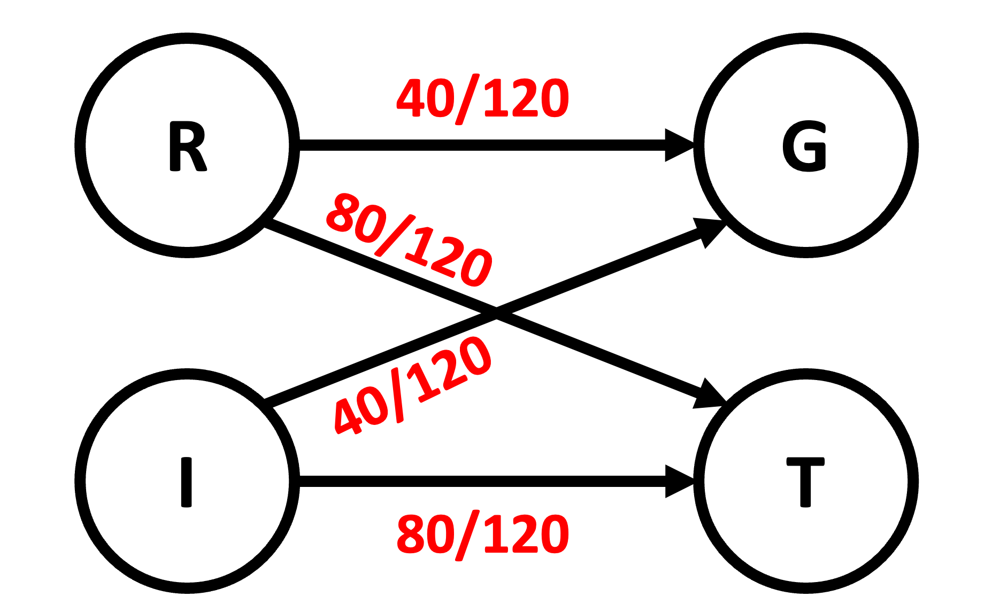

# CAPWizard for IAEA MESSAGE

    

## Version

Current Version: v20240518

## Overview

CAP Wizard for IAEA MESSAGE is a multifaceted tool developed to streamline result processing and overcome challenges in processing results from the IAEA MESSAGE tool. It offers a suite of modules, each targeting specific issues encountered by IAEA MESSAGE users. While the interactive mode in IAEA MESSAGE addresses some limitations of the CAP program, the interactive mode’s capabilities for analyzing results are restricted. CAP Wizard leverages the IAEA MESSAGE CAP program and addresses known calculation challenges, such as discrepancies in total installed capacity and fixed costs, particularly when plant lifespans don't align with the study years of the model.

The first module of CAP Wizard focuses on generating special Tech and LDR `cin` files, which need to be placed within the `data` folder of the model folder. At this model the user should run along with CAP to generate the results. The results can be found within the `res` folder that is contained in the model folder and are named `LDR_CAP_adb.tab` and `Tech_CAP_adb.tab`. These results from these files can be copied into MS Excel using text import wizard function of Excel. Once imported into Excel these files, CAP Wizard further processes the outputs and enriches the results with data beyond what is available from MESSAGE interactive outputs by using the ADB database file from the model in its second module for processing the results. It further enhances the results by a customizable template MS Excel file, enabling users to tailor the tool to their specific model requirements. For instance, users can add generation types to technologies in the model, allowing for more detailed filtering in the processed results. Furthermore, CAP Wizard uniquely supports LDR results processing and introduces a novel approach to cost calculations in a special module, detailed in the cost calculation section.

The processed result file is generated and outputted as an MS Excel file, facilitating more analysis and visualization, including the use of pivot tables with extensive filtering options. This makes the processed results the main file for results analysis and visualization.

A [demo case](Demo_Case) has been added for a reference to showcase how `Cap Wizard` works which is a modification of demo_case5 that is built in with MESSAGE.

The streamlined workflow for running a model and analyzing results is as follows:

1. **Model Execution**: Run the MESSAGE model.
2. **CAP File Generation**: Use CAPWizard to generate Tech and LDR files.
3. **Place Cin Files**: Move generated cin files to `data` folder of the model directory.
4. **Select Cin Files**: Select cin files in IAEA MESSAGE. Choose `Select` menu in the toolbar then the `cinfiles` option.
5. **Run CAP**: Execute CAP in IAEA MESSAGE.
6. **Results Conversion**: Import results 
    <ol type="a">
        <li>Go to folder for the model containing and open the subfolder titled <code>res</code>.</li>
        <li>Open <code>Tech_CAP_adb.tab</code> and <code>LDR_CAP_adb.tab</code> and copy the results from these files.</li>
        <li>Paste into Excel using the MS Excel text import wizard. The delimiter is usually a space or a tab character.</li>
        <li>Save the file where necessary.</li>
    </ol>
7. **Results Processing**: Utilize CAPWizard to process these results.
8. **Data Analysis & Visualization**: Refresh the pivot table and plotting data sources in Excel for advanced analysis and visualizations.

## Cost Calculation

Consider the following simple scenario (Figure 1): to produce 100 Tonnes of Oil Equivalent (toe) of Diesel for public transport, a refinery needs 300$ worth of crude oil, 70$ of electricity, and 20$ of total operating costs (e.g., catalysts, wear and tear, etc.). What is the total cost to produce this Diesel?
Intuitively, the cost would just be the cost of the inputs, $20 + 300 + 70 = 390$\$. 

<figure>
    
    <figcaption>Figure 1: Simplest cost calculation case</figcaption>
</figure>

Refineries do not just produce one product, so suppose that the refinery also produces 50 toe of Kerosene for aviation, and that the input costs remain unchanged (Figure 2). What is the cost of producing the Diesel?

<figure>
    
    <figcaption>Figure 2: A refinery that has multiple outputs</figcaption>
</figure>

Without specific knowledge about how the refinery uses each input to produce each output, it is impossible to answer this question. So we make a simple assumption: the cost of producing each output is proportional to its relative share of all of the refinery's outputs. In this example, Diesel and Kerosene comprise $\frac{100}{150} = 0.67$ and $\frac{50}{150} = 0.33$ of the refinery's output, respectively. Therefore, the cost to produce Diesel is $0.67 \times (20 + 300 + 70) = 260$\$. 

To summarize, the cost along a particular output edge $AB$ is:
$$Cost(A \rightarrow B) = w_{AB} \times \sum_{i \in S}{Cost(i \rightarrow A)}$$
$$w_{AB} = \frac{u_{AB}}{\sum_{j \in T}{u_{Aj}}}$$

where $u_{AB}$ is the absolute number of units supplied by $A$ to $B$, $w_{AB} \in [0,1]$ is the corresponding normalized number of units, $S$ is the set of nodes that supply $A$, and $T$ is the set of nodes supplied by $A$.

### Handling Loops

Real energy systems are not nice like the previous two example; they often contain feedback loops. 
In the examples above, the electricity for the refinery could come from a generator, which in turn could be powered by the Diesel that the refinery produces.
In Figure 3, nodes $R$, $G$, and $D$ correspond to refinery, generator, and demand nodes, respectively.
As with the previous examples: what is the cost of producing Diesel, i.e., $Cost(R \rightarrow G)$? 

<figure>
    
    <figcaption>Figure 3: a refinery that uses the electricity generated by the power plant it supplies with Diesel.</figcaption>
</figure>

By applying the cost equation above:

$$Cost(R \rightarrow G) =w_{RG}\times\left(300+20+Cost(G \rightarrow R)\right)$$
$$Cost(G \rightarrow R) =w_{GR}\times\left(50+Cost(R \rightarrow G)\right)$$

Combining the previous two equations, we get:

$$Cost(R \rightarrow G) =\frac{320+50w_{GR}}{1-w_{GR}} = 339.5\$$$

As $w_{GR}$ increases (i.e., as the refinery needs more electricity), the cost to produce the Diesel increases. When $w_{GR} = 0$, the cost becomes $320\$$, just as in the first example.

We can also derive the total cost to produce electricity for final demand:

$$Cost(G \rightarrow D)=w_{GD}\times\left(50+Cost(R \rightarrow G)\right) = 370\$$$

One more complexity in the real-world is that there can be multiple edges between two nodes. 
In Figure 4 for example, the refinery supplies the generator with diesel and HFO. The notation $w_{AB}^{\textrm{F}}$ indicates the relative output of $A$ to $B$ of fuel $F$. What is the cost of Diesel in this case?

<figure>
    
    <figcaption>Figure 4: a refinery that produces diesel and HFO which are consumed by the generator.</figcaption>
</figure>

Similarily to the previous example, we follow the structure of the graph.

$$Cost(R \xrightarrow{\textrm{diesel}} G)=w_{RG}^{\textrm{\textrm{diesel}}}\times\left(320+Cost(G \rightarrow R)\right)$$
$$Cost(G \rightarrow R)=w_{GR}\times(50+Cost(R \xrightarrow{\textrm{diesel}} G)+Cost(R \xrightarrow{\textrm{HFO}} G))$$

At this point we see that:

$$Cost(R \xrightarrow{\textrm{diesel}} G)+Cost(R \xrightarrow{\textrm{HFO}} G)=\left(w_{RG}^{\textrm{diesel}}+w_{RG}^{\textrm{HFO}}\right)\left(320+Cost(G \rightarrow R)\right)$$
$$=w_{RG}^{*}\left(320+Cost(G \rightarrow R)\right)$$

where $w_{RG}^{*} = w_{RG}^{\textrm{diesel}}+w_{RG}^{\textrm{HFO}}$. After some algebriac manipulation, we get:

$$Cost(G \rightarrow R)=\frac{w_{GR}\left(50+320w_{RG}^{\ast}\right)}{1-w_{GR}w_{RG}^{\ast}}$$

So $Cost(R \xrightarrow{\textrm{diesel}} G) = 255\$$.  

**The important point in this example** is that we can collapse the multiple edges from $R$ to $G$ into one edge with a weight equal to the sum of the weights of individual edges ($w_{RG}^{*}$).

## Algorithm

Directly deriving the algebriac expressions for arbitrary graphs can be daunting. Instead, we opt for a straightforward numerical implementation that matches the above analytical solutions within few iterations. The algorithm is implemented and thoroughly documented in the `calculate_cost()` and `calculate_cost_inner()` functions inside `CostCalculation.py`. 

## Representation Conversion

The energy system structure is not defined exactly as described in the previous examples. Instead, it is described in terms of the fuels that nodes produce and consume. That is, there is no explicit connections between nodes (e.g., a refinery to a generator) as in the previous examples. Because of this, an extra step is needed to convert the energy system into a network representation where costs can be calculated.
An example of this is shown in the left part of Figure 5. Here, natural gas is imported (via the I node) and produced by the refinery R. A generator G consumes the natural gas and the rest goes to fulfill transportation demand T. 
To perform the cost calculation described above, these four nodes should be explicitly linked  (Figure 5, right).

<figure>
    
    <figcaption>Figure 5: converting from the original energy system representation (left) to the cost calculation representation (right). R, I, G, and T correspond to refinery, import, generator, and transportation demand, respectively.</figcaption>
</figure>

To do this, we assume that the contribution of a producer node (R or I) to a consumer node's demand for a fuel (G or T) is equal to the producer's relative production share of that fuel: 

$$u_{AB}^{F}=\frac{\mathrm{Prod}_{A}^{F}}{\sum_{i}\mathrm{Prod}_{i}^{F}} \times \mathrm{Demand}_{B}^{F}$$

where $u_{AB}^{F}$ is the number of units of $F$ supplied from $A$ to $B$, $\mathrm{Prod}_{A}^{F}$ is how much node $A$ produces of fuel $F$, and $\mathrm{Demand}_{B}^{F}$ is how much node $B$ demands of fuel $F$. The refinery and import nodes' relative shares are $\frac{100}{120} = 0.83$ and $\frac{20}{120} = 0.17$, respectively. Therefore, the refinery supplies the generator and transport nodes with $0.83 \times 40 = 33.3$ and $0.83 \times 80 = 66.67$ Toe, respectively. 

In the cost calculation examples earlier, the reader might have noticed that the absolute number of units across each link is unimportant; it is their relative weight $w_{ab}$ that's required.
We can get those weights by normalizing the outgoing edges from each node, across all fuels: 

$$w_{AB}^{F}=\frac{u_{AB}^{F}}{\sum_{k}\sum_{j}u_{Aj}^{k}}$$

In Figure 5, there is only one fuel. The weight from the refinery to the generator is $w_{RG} = \frac{0.83 \times 40}{0.83 \times \left(40 + 80\right)} = 0.33$, and the weight from the refinery to transport demand is $w_{RT} = \frac{0.83 \times 80}{0.83 \times \left(40 + 80\right)} = 0.67$. Figure 6 shows the final weights.

<figure>
    
    <figcaption>Figure 6: the transformed network with weights along all edges.</figcaption>
</figure>

The conversion above is done by the `to_network()` function in `TopologyConverter.py` file.

## Requirements

- Windows OS or macOS to run the packaged application.

## Installation

For end-users:

- For macOS: [Download](https://github.com/KISRDevelopment/CAPWizard/raw/master/Installer/CAPWizard.dmg)
- For Windows: [Download](https://github.com/KISRDevelopment/CAPWizard/raw/master/Installer/CAPWizard.exe)

Additionally, download the `template.xlsx` to customize the tool for your specific model.

For developers and advanced users:

- The source code is open-sourced for those who wish to tailor or extend the application.
- Python environment setup and dependencies are documented for development purposes.

## Usage

1. **Select ADB File**: Browse and select the desired ADB file for CAP file generation or result processing.
2. **Set Parameters**: Input required parameters such as the number of runs for simulations.
3. **Generate CAP Files**: Use the 'Generate Tech CAP' or 'Generate LDR CAP' buttons to create capacity files, which are then used in MESSAGE.
4. **Process Simulation Outputs**: Import MESSAGE simulation results into Excel, fill in the template file, and use CAPWizard to process these results for detailed analysis.

## Packaging for Developers

- Use `package_app.py` to package your modified version of the application.
- On macOS, ensure `create_dmg` is installed for `.dmg` file creation.

## What's New

For details on the latest updates and changes in CAPWizard for IAEA MESSAGE, please see the [change log](changelog.md) file.

## License

This software is released under the Apache License 2.0. This license is a permissive open-source license that includes provisions for attribution. It allows users to use, modify, and distribute the software while requiring proper credit to be given to the original author. Therefore, any redistribution of this software must clearly attribute development to Yousef S. Al-Qattan & Mohammad M. Khajah from Kuwait Institute for Scientific Research (KISR). 

## Authors

The software has been developed by
1. Yousef S. Al-Qattan, Kuwait Institute for Scientific Research (KISR): initial idea, data processing, GUI development, integration, documentation.
2. Mohammad M. Khajah, Kuwait Institute for Scientific Research (KISR): network conversion and cost calculation algorithms, documentation.

## Acknowledgements

Special thanks to Dr. Emmanuel Guemene Dountio and Dr. Arvydas Gallinis for their guidance and support throughout the development of this tool. Also, would like to thank Dr. Yousef M. Al-Abdullah for his contributions in writing the readme file.